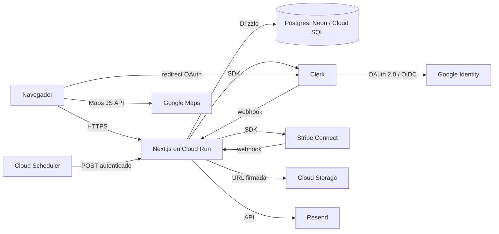
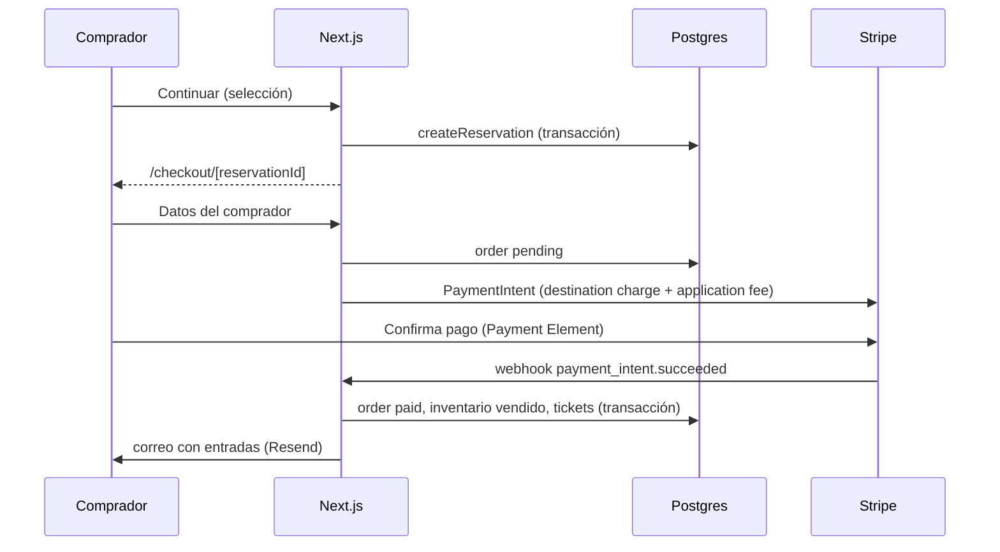
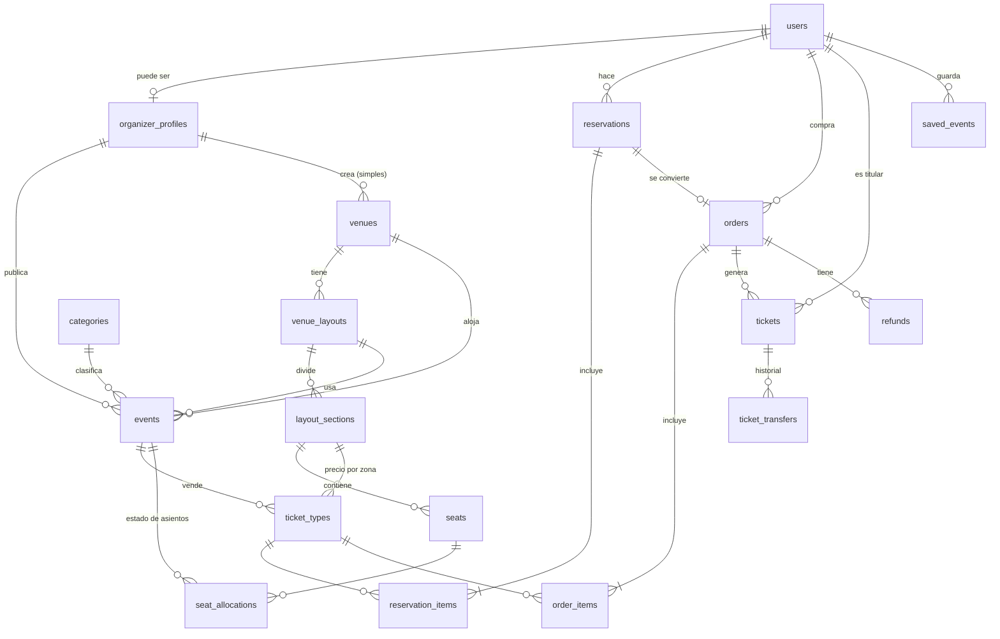

# System Design y MER — Ticketera

- **Fecha:** 2026-10-04
- **Estado:** en revisión del usuario
- **Actualizado:** 2026-10-07 — detalle del login con Google (§3.1, §3.3, §4.1.1), variables de entorno (§3.4) y espejo de métodos de ingreso en `users` (§6.3, §6.4).
- **Alcance:** arquitectura del sistema (ambientes, componentes, autenticación, roles, pagos, flujo de compra) y modelo entidad-relación de la base de datos. Este documento **no** implementa código, migraciones ni infraestructura.
- **Base:** la UI ya construida (specs 001–008) y el diseño de referencia analizado en `docs/design/reference-design.md` (21 pantallas: landing, búsqueda, detalle, entradas, checkout, confirmación, login, mis entradas, panel de organizador, crear evento).

---

## 1. Objetivo y criterios de éxito

Pasar de una UI con datos mock a un sistema real sin rediseñar lo construido. Se considera logrado cuando:

1. Cada pantalla de la referencia tiene de dónde leer y dónde escribir sus datos en el MER.
2. Los cuatro roles tienen permisos claros y verificables en el servidor.
3. El flujo de compra garantiza que un asiento o cupo nunca se vende dos veces, aun con compras simultáneas.
4. Local y producción usan el mismo código; solo cambian variables de entorno.
5. Los services actuales (`eventsService`, `seatingService`) pueden pasar de leer mocks a leer la base sin cambiar los componentes.

---

## 2. Decisiones tomadas

| Tema | Decisión |
|---|---|
| Backend | Dentro de Next.js (Server Components, Server Actions, Route Handlers). Un solo despliegue. |
| Enfoque | Monolito modular con Postgres como fuente de verdad. Efectos secundarios detrás de una interfaz para poder moverlos a una cola más adelante. |
| ORM | Drizzle ORM + drizzle-kit. |
| Base local | Neon Postgres. |
| Producción | Google Cloud Platform: Cloud Run + Cloud SQL Postgres. |
| Autenticación | Clerk: email/password y Google. |
| Pagos | Stripe Connect (cuentas Express) con *destination charges*. |
| Comisión | La paga el comprador como **cargo por servicio** aparte; el precio de la entrada llega íntegro al organizador. |
| País y moneda | Estados Unidos, USD. |
| Archivos | Google Cloud Storage, un bucket por ambiente. |
| Correo | Resend con plantillas React Email. |
| Mapas | Google Maps solo en producción. |
| Organizador | Un usuario = un organizador (sin equipos). |
| Multi-rol | Todo usuario es cliente; organizador es una capacidad extra; staff es aparte. |
| Admins | Super admin = dueño técnico. Administrador = opera la plataforma. |
| Publicación | Directa; los admins solo despublican o suspenden después. |
| Reservas | Temporales, con vencimiento configurable. |
| Post-compra | Reembolso, transferencia y check-in. Sin reventa. |
| Recintos | Catálogo curado por admins con planos; el organizador puede crear un lugar simple sin plano. |
| Staging | No, por ahora. |

---

## 3. Arquitectura

### 3.1 Componentes

### 3.2 Estructura del código

Sigue `docs/SETUP.md` y lo ya construido:

- `src/app/` — solo rutas, Server Actions delgadas y Route Handlers. No contiene lógica de negocio.
- `src/modules/<dominio>/services/` — lógica de negocio. **Único lugar que accede a la base.** Dominios: `events`, `seating`, `checkout` (existentes) y `orders`, `tickets`, `organizers`, `venues`, `admin`, `accounts` (nuevos).
- `src/db/` — `client.ts` (conexión Drizzle), `schema/` (un archivo por dominio con las tablas) y `migrations/`. Se usa una carpeta única porque drizzle-kit necesita un punto de entrada para todo el esquema, y así no choca con el sufijo `.schema.ts` que SETUP reserva para zod.
- `src/lib/integrations/` — adaptadores delgados: `clerk.ts`, `stripe.ts`, `resend.ts`, `storage.ts`, `maps.ts`. Los services dependen de estas funciones, no de los SDKs.
- `src/lib/auth/` — guards de autorización (§4.3).
- `src/lib/env.ts` — validación con zod de todas las variables de entorno al arrancar.

Los mocks actuales (`events.mock.ts`, `ticket-types.mock.ts`, `zone-maps.mock.ts`, `seat-maps.mock.ts`) se reemplazan por consultas dentro de sus services; los contratos de los services se mantienen para no tocar los componentes. Los mocks pasan a ser datos de *seed* para desarrollo.

### 3.3 Ambientes

| | Local | Producción |
|---|---|---|
| App | `next dev` en localhost | Cloud Run (imagen en Artifact Registry) |
| Base | Neon Postgres (branch `dev`; branches por PR opcionales) | Cloud SQL Postgres vía Cloud SQL Connector |
| Archivos | Bucket GCS `…-dev` | Bucket GCS `…-prod` |
| Clerk | Instancia de desarrollo | Instancia de producción |
| Google OAuth | Credenciales compartidas de Clerk; no se configura nada en Google Cloud | OAuth client propio (Google Cloud → Credentials, tipo Web) con el *Authorized redirect URI* que indica Clerk; pantalla de consentimiento publicada |
| Stripe | Modo test; `stripe listen` reenvía webhooks a localhost | Modo live; endpoint de webhook firmado |
| Correo | Resend en sandbox | Resend con dominio verificado |
| Maps | Desactivado: placeholder estático del lugar | Maps JavaScript API, key restringida al dominio |
| Secretos | `.env` o `.env.local` (plantilla versionada en `.env.example`) | Secret Manager montado como variables de entorno |
| Tareas programadas | No hacen falta (vencimiento al leer) | Cloud Scheduler → `POST /api/cron/release-holds` |

Reglas transversales:

- **Variables de entorno:** `src/lib/env.ts` falla al arrancar si falta una obligatoria. Google Maps es opcional: la funcionalidad se activa solo si existe su key.
- **Driver:** el mismo driver `postgres` (Node) para Neon y Cloud SQL, con un pool chico por instancia. No hay código distinto por ambiente.
- **Migraciones:** se generan con `drizzle-kit generate` y se versionan en el repo. En local se aplican contra Neon. En producción se aplican en el pipeline (Cloud Build o GitHub Actions) antes del despliegue, como un Cloud Run Job.
- **Cron:** `/api/cron/release-holds` exige un token OIDC de la cuenta de servicio de Cloud Scheduler; responde 401 sin él.

### 3.4 Variables de entorno

La plantilla es `.env.example` (versionada, sin valores). En local se copia a `.env` o `.env.local`, ambos ignorados por git. Solo las `NEXT_PUBLIC_*` llegan al navegador.

| Variable | Servicio | Obligatoria desde |
|---|---|---|
| `NEXT_PUBLIC_CLERK_PUBLISHABLE_KEY`, `CLERK_SECRET_KEY` | Clerk | Login (spec 013); `next build` falla sin ellas |
| `CLERK_WEBHOOK_SIGNING_SECRET` | Clerk (webhook → `users`) | Base de datos |
| `NEXT_PUBLIC_STRIPE_PUBLISHABLE_KEY`, `STRIPE_SECRET_KEY`, `STRIPE_WEBHOOK_SECRET` | Stripe | Pagos reales |
| `DATABASE_URL` | Neon (local) / Cloud SQL (prod) | Base de datos |

Google no tiene variables propias en la app: sus credenciales se cargan en el Dashboard de Clerk.

---

## 4. Autenticación y roles

### 4.1 Identidad

- Clerk gestiona sesiones, contraseñas, verificación de email y login con Google (§4.1.1).
- Las pantallas de login y registro se construyen con los hooks de Clerk (`useSignIn`, `useSignUp`) para respetar el diseño de referencia (`Auth`/`AuthMobile`), no con los componentes prearmados.
- **Espejo en la base:** tabla `users` con `clerk_user_id` único.
  - Se sincroniza por webhook de Clerk (`user.created`, `user.updated`, `user.deleted`).
  - Además hay un *upsert* en el primer request autenticado, por si el webhook llega tarde.
  - `user.deleted` **anonimiza** la fila (email y nombre reemplazados, `deleted_at` con fecha). No se borra, para conservar las órdenes.

#### 4.1.1 Login con Google

- **Flujo:** el botón "Continuar con Google" de `/sign-in` y `/sign-up` inicia el SSO de Clerk (`signIn.sso` / `signUp.sso`, API de Clerk Core 3). El navegador va a Google, vuelve a Clerk y termina en `/sso-callback`, que completa la sesión y redirige al destino (`redirect_url` validado o `/`).
- **Un solo usuario por persona:** si el correo de Google ya existe y está verificado, Clerk vincula la cuenta de Google a ese usuario (no crea otro). Un usuario puede tener contraseña, Google o ambos; siempre es **una** fila en `users` (`clerk_user_id`).
- **Datos que trae Google:** correo (verificado), nombre, apellido y foto. El webhook los copia a `users.email`, `full_name` y `avatar_url`, y registra el método en `users.auth_providers` (§6.4). La app nunca guarda tokens de Google.
- **Requisitos en Clerk:** teléfono y username desactivados o no obligatorios, y nombre/apellido opcionales. Si no, el alta por Google queda en `missing_requirements`.
- **Sin Google:** si la conexión está desactivada o falla, la pantalla muestra un error legible y el login con email/contraseña sigue funcionando.
- **Producción:** OAuth client propio de Google (§3.3). Con las credenciales compartidas de desarrollo, Google muestra "Clerk" en la pantalla de consentimiento.

### 4.2 Roles

La base es la **fuente de verdad**:

| Rol | Cómo se representa |
|---|---|
| Cliente | Implícito: todo usuario. |
| Organizador | Existe una fila en `organizer_profiles` para el usuario (1:1). |
| Administrador | `users.staff_role = 'admin'`. |
| Super admin | `users.staff_role = 'super_admin'`. |

- `staff_role` y la marca de organizador se copian a `publicMetadata` de Clerk, para que el middleware/proxy de Next filtre rutas sin consultar la base. La copia la escribe solo el service que cambia el rol. **Nunca se usa para decidir permisos.**
- El primer super admin se asigna con un script de *seed* que toma su email de una variable de entorno.

### 4.3 Autorización

Toda Server Action y todo Route Handler llama a un guard de `src/lib/auth/` antes de actuar:

- `requireUser()` — sesión válida y fila en `users`.
- `requireOrganizer()` — además, `organizer_profiles.status = 'active'`.
- `requireStaff("admin" | "super_admin")` — `super_admin` cumple también `admin`.
- Chequeo de propiedad en el service: un organizador solo opera sobre eventos con su `organizer_id` y solo hace check-in o reembolsos en ellos.

Ocultar botones en la UI no reemplaza estas validaciones.

### 4.4 Matriz de permisos

| Acción | Cliente | Organizador | Admin | Super admin |
|---|:-:|:-:|:-:|:-:|
| Comprar, ver y transferir sus entradas; guardar eventos | ✓ | ✓ | ✓ | ✓ |
| Crear, editar, publicar, despublicar y cancelar *sus* eventos | | ✓ | | |
| Ver ventas de *sus* eventos | | ✓ | | |
| Check-in y reembolsos en *sus* eventos | | ✓ | ✓ | ✓ |
| Despublicar o suspender cualquier evento; suspender organizadores | | | ✓ | ✓ |
| Catálogo de recintos y planos | | | ✓ | ✓ |
| Reembolsos en cualquier orden; soporte (ver órdenes y usuarios) | | | ✓ | ✓ |
| Marcar eventos como destacados | | | ✓ | ✓ |
| Asignar o quitar administradores | | | | ✓ |
| Configuración global (cargo por servicio, minutos de reserva, máximo por zona) | | | | ✓ |

El cliente no inicia reembolsos; los inician el organizador o un admin.

### 4.5 Alta como organizador

1. El usuario pulsa "Vender entradas": se crea `organizer_profiles` con `status = 'onboarding'`.
2. Se crea la cuenta Stripe Connect Express y se redirige al onboarding de Stripe.
3. El webhook `account.updated` actualiza `charges_enabled` y `payouts_enabled`. Con `charges_enabled = true`, `status` pasa a `active`.
4. Solo un organizador `active` puede publicar eventos con venta.

---

## 5. Flujo de compra y pagos

### 5.1 Resumen

### 5.2 Reserva temporal

- Al pulsar "Continuar" en la selección (`/tickets` o `/seats`) se exige sesión.
- La Server Action `createReservation(eventId, selection)` ejecuta **una transacción**:
  - **Entrada por zona o general:** bloquea la fila de `ticket_types` con `SELECT … FOR UPDATE` y verifica `capacity − sold_count − reservado vigente ≥ cantidad pedida`.
  - **Asiento numerado:** inserta filas en `seat_allocations` con `status = 'held'`. La restricción única `(event_id, seat_id)` hace imposible reservar un asiento ocupado; si choca, la transacción falla con `SeatUnavailableError`.
  - Crea `reservations` con `expires_at = now() + platform_settings.reservation_minutes` y sus `reservation_items` con el precio copiado (`unit_price_cents`).
- Cada usuario tiene como máximo **una reserva activa por evento**: crear una nueva cancela la anterior y libera su inventario.
- Redirige a `/checkout/[reservationId]`. Desde aquí la reserva es la fuente de verdad, no la URL.

**"Reservado vigente"** = suma de `reservation_items.quantity` de reservas con `status = 'active'` y `expires_at > now()`. Una reserva vencida deja de contar sin que nadie la toque.

### 5.3 Checkout

- Cuenta regresiva calculada desde `expires_at`.
- Datos del comprador: nombre completo, email y celular (opcional). **Se elimina** el documento DNI/CE/Pasaporte de la referencia (es de Perú).
- Métodos de pago: Stripe Payment Element con tarjeta, Apple Pay y Google Pay. **Se eliminan** Yape y PagoEfectivo de la referencia.
- El server crea la `order` (`status = 'pending'`) con:
  - `subtotal_cents` = suma de los ítems;
  - `service_fee_cents` = `round(subtotal × service_fee_bps / 10000) + service_fee_fixed_cents`;
  - `total_cents` = subtotal + cargo por servicio.
- Crea el PaymentIntent de Stripe:
  - `amount` = `total_cents`;
  - `transfer_data.destination` = `stripe_account_id` del organizador;
  - `application_fee_amount` = `service_fee_cents`;
  - `metadata.order_id` = id de la orden.
- La UI muestra "Cargo por servicio" como línea aparte en el resumen.

### 5.4 Confirmación

El navegador **no** confirma la compra; lo hace el webhook.

- `payment_intent.succeeded` ejecuta una transacción idempotente:
  1. `orders.status = 'paid'`, `paid_at = now()`;
  2. `reservations.status = 'converted'`;
  3. inventario a vendido: `ticket_types.sold_count += cantidad`; `seat_allocations.status = 'sold'`;
  4. crea una fila en `tickets` por unidad, cada una con su `qr_token` aleatorio.
- Después de la transacción se envía el correo de confirmación con Resend.
- La página de confirmación muestra "Procesando tu pago" hasta que la orden figura como `paid`.
- **Pago tardío:** si el pago llega con la reserva vencida, se acepta solo si el inventario sigue libre (se reintenta la reserva dentro de la misma transacción). Si no, se crea un reembolso automático completo, la orden queda `refunded` y se avisa al comprador.
- `payment_intent.payment_failed`: `orders.status = 'failed'`. La reserva sigue vigente hasta vencer, para permitir reintentar.

### 5.5 Vencimiento de reservas

- Las consultas de disponibilidad solo cuentan reservas vigentes (§5.2): una reserva vencida libera su lugar sola.
- En producción, Cloud Scheduler llama cada minuto a `/api/cron/release-holds`, que:
  - marca `status = 'expired'` en reservas activas vencidas;
  - borra sus `seat_allocations` con `status = 'held'`;
  - cancela el PaymentIntent asociado si todavía no se pagó.

### 5.6 Reembolsos

- Los inicia un organizador (en sus eventos) o un admin (en cualquiera).
- Siempre son **por la orden completa** (entradas + cargo por servicio). No hay reembolsos parciales.
- Se llama a Stripe con `reverse_transfer = true` y `refund_application_fee = true`; se registra en `refunds`.
- El webhook `charge.refunded` marca la orden `refunded`, anula todas sus entradas (`tickets.status = 'void'`) y, si el evento aún no ocurrió, libera el inventario (`sold_count -=`, borra `seat_allocations`).
- No se puede reembolsar una orden con alguna entrada ya `used`.
- **Cancelar un evento** reembolsa todas sus órdenes pagadas.
- Queda en `audit_logs` quién lo hizo y por qué.

### 5.7 Transferencias

- El titular ingresa el email del destinatario.
- Si existe un usuario con ese email, la entrada se le asigna de inmediato (`holder_user_id`). Si no, el traspaso queda `pending` y se acepta automáticamente cuando esa persona se registra (por webhook `user.created`).
- Se regenera `qr_token`: el QR anterior deja de ser válido.
- Cada traspaso queda en `ticket_transfers`.
- No se puede transferir una entrada `used` o `void`.

### 5.8 Check-in

- El organizador abre la página de escaneo en el navegador del celular y lee el QR con la cámara.
- El QR contiene solo el `qr_token` opaco, nunca el id de la entrada.
- El server valida que la entrada pertenezca a un evento del organizador y la marca con:
  `UPDATE tickets SET status = 'used', checked_in_at = now(), checked_in_by = $user WHERE qr_token = $token AND status = 'valid' AND checked_in_at IS NULL`.
  Si no actualiza ninguna fila, responde "Entrada ya usada o no válida". Así dos escaneos simultáneos nunca validan la misma entrada.

---

## 6. Modelo entidad-relación

### 6.1 Convenciones

- PK `id uuid` (generado con `gen_random_uuid()`), salvo donde se indica.
- Dinero en centavos enteros (`integer`, sufijo `_cents`). Moneda única `usd`, guardada en las órdenes por si en el futuro hay más.
- Fechas `timestamptz` en UTC. La hora local de un evento se calcula con `venues.timezone`.
- Imágenes: se guarda la *key* de GCS (`*_key`), no la URL.
- Todas las tablas tienen `created_at` y, si se editan, `updated_at`.
- Enums como tipos `enum` de Postgres.
- Borrado lógico (`deleted_at`) solo donde hay historial económico (`users`).

### 6.2 Diagrama

### 6.3 Enums

| Enum | Valores |
|---|---|
| `staff_role` | `admin`, `super_admin` |
| `organizer_status` | `onboarding`, `active`, `suspended` |
| `layout_kind` | `zones`, `seated` |
| `section_kind` | `general_admission`, `seated` |
| `event_status` | `draft`, `published`, `cancelled`, `suspended` |
| `seat_allocation_status` | `held`, `sold` |
| `reservation_status` | `active`, `converted`, `expired`, `cancelled` |
| `order_status` | `pending`, `paid`, `failed`, `refunded` |
| `refund_status` | `pending`, `succeeded`, `failed` |
| `ticket_status` | `valid`, `used`, `void` |
| `transfer_status` | `pending`, `accepted`, `cancelled` |
| `webhook_provider` | `stripe`, `clerk` |
| `auth_provider` | `password`, `google` |

### 6.4 Tablas

#### Identidad y configuración

**`users`**
| Columna | Tipo | Notas |
|---|---|---|
| `id` | uuid PK | |
| `clerk_user_id` | text | único, not null |
| `email` | text | único (case-insensitive), not null |
| `full_name` | text | |
| `avatar_url` | text | viene de Clerk (foto de Google si entra con Google) |
| `auth_providers` | auth_provider[] | not null, default `{}`; métodos de ingreso vinculados en Clerk (`password_enabled` y `external_accounts`). Solo informativo (soporte, admin); **no** se usa para autorizar |
| `phone` | text | null |
| `staff_role` | staff_role | null = sin rol de staff |
| `deleted_at` | timestamptz | null; anonimizado si tiene valor |

**`organizer_profiles`**
| Columna | Tipo | Notas |
|---|---|---|
| `id` | uuid PK | |
| `user_id` | uuid FK → users | único |
| `display_name` | text | not null |
| `slug` | text | único |
| `logo_key` | text | null |
| `stripe_account_id` | text | único, null hasta el onboarding |
| `charges_enabled` | boolean | default false |
| `payouts_enabled` | boolean | default false |
| `status` | organizer_status | default `onboarding` |
| `suspended_reason` | text | null |

**`platform_settings`** (una sola fila, `id = 1`)
| Columna | Tipo | Notas |
|---|---|---|
| `id` | smallint PK | check `id = 1` |
| `service_fee_bps` | integer | puntos básicos (1000 = 10 %) |
| `service_fee_fixed_cents` | integer | cargo fijo por orden |
| `reservation_minutes` | integer | default 10 |
| `max_tickets_per_zone` | integer | default 6 |
| `updated_by` | uuid FK → users | |

#### Catálogo

**`categories`**: `id`, `slug` (único), `name`, `sort_order`.

**`venues`**
| Columna | Tipo | Notas |
|---|---|---|
| `id` | uuid PK | |
| `name` | text | not null |
| `slug` | text | único |
| `address_line` | text | |
| `city` | text | not null |
| `state` | text | |
| `postal_code` | text | |
| `country` | char(2) | default `US` |
| `lat`, `lng` | numeric(9,6) | para Google Maps |
| `google_place_id` | text | null |
| `timezone` | text | IANA, p. ej. `America/New_York` |
| `is_curated` | boolean | true = catálogo de admins |
| `owner_organizer_id` | uuid FK → organizer_profiles | null en recintos curados |
| `created_by` | uuid FK → users | |

Check: `is_curated = true` ⇔ `owner_organizer_id IS NULL`.

**`venue_layouts`**: `id`, `venue_id` FK, `name`, `kind` (layout_kind), `stage` (jsonb: área del escenario en la grilla o el lienzo).

**`layout_sections`**
| Columna | Tipo | Notas |
|---|---|---|
| `id` | uuid PK | |
| `layout_id` | uuid FK → venue_layouts | |
| `code` | text | único dentro del layout |
| `name` | text | p. ej. "Platea", "Norte" |
| `kind` | section_kind | |
| `capacity` | integer | obligatorio si `general_admission` |
| `map_area` | jsonb | posición en el mapa de zonas (spec 007) |
| `sort_order` | integer | |

**`seats`**: `id`, `section_id` FK, `row_label`, `seat_number`, `x`, `y` (numeric, coordenadas del SVG de la spec 008), `is_accessible`. Único: `(section_id, row_label, seat_number)`.

#### Eventos

**`events`**
| Columna | Tipo | Notas |
|---|---|---|
| `id` | uuid PK | |
| `organizer_id` | uuid FK → organizer_profiles | not null |
| `category_id` | uuid FK → categories | not null |
| `venue_id` | uuid FK → venues | not null |
| `layout_id` | uuid FK → venue_layouts | null = sin plano |
| `slug` | text | único |
| `title` | text | not null |
| `description` | text | |
| `cover_key` | text | key de GCS |
| `starts_at` | timestamptz | not null |
| `doors_open_at` | timestamptz | < `starts_at` |
| `min_age` | integer | null = todo público |
| `status` | event_status | default `draft` |
| `is_featured` | boolean | default false; lo marca un admin |
| `published_at`, `cancelled_at`, `suspended_at` | timestamptz | |
| `suspended_reason` | text | |

Check: si `layout_id` no es null, debe pertenecer a `venue_id`. Índices: `(status, starts_at)`, `(category_id, starts_at)`, `organizer_id`.

**`ticket_types`**
| Columna | Tipo | Notas |
|---|---|---|
| `id` | uuid PK | |
| `event_id` | uuid FK → events | |
| `section_id` | uuid FK → layout_sections | null en eventos sin plano |
| `name` | text | |
| `price_cents` | integer | ≥ 0 |
| `capacity` | integer | ≥ 0 |
| `sold_count` | integer | default 0; check `≤ capacity` |
| `sort_order` | integer | |

Único: `(event_id, section_id)` cuando `section_id` no es null. Esta fila es la que se bloquea con `FOR UPDATE` al reservar. La disponibilidad que muestra la UI (`available`, `last-tickets`, `sold-out`) se calcula a partir de `capacity`, `sold_count` y lo reservado vigente.

**`seat_allocations`**
| Columna | Tipo | Notas |
|---|---|---|
| `id` | uuid PK | |
| `event_id` | uuid FK → events | |
| `seat_id` | uuid FK → seats | |
| `status` | seat_allocation_status | |
| `reservation_id` | uuid FK → reservations | |
| `ticket_id` | uuid FK → tickets | null mientras está `held` |

**Único `(event_id, seat_id)`:** garantiza que un asiento no se reserve ni se venda dos veces. Liberar un asiento = borrar su fila.

**`saved_events`**: PK `(user_id, event_id)`, `created_at`.

#### Compra

**`reservations`**: `id`, `user_id` FK, `event_id` FK, `status` (reservation_status), `expires_at`. Índice parcial único `(user_id, event_id) WHERE status = 'active'` (una reserva activa por evento). Índice `(status, expires_at)` para el cron.

**`reservation_items`**: `id`, `reservation_id` FK, `ticket_type_id` FK, `seat_id` FK null, `quantity` (1 si hay asiento), `unit_price_cents`.

**`orders`**
| Columna | Tipo | Notas |
|---|---|---|
| `id` | uuid PK | |
| `code` | text | único, formato `TK-XXXXX` |
| `user_id` | uuid FK → users | |
| `event_id` | uuid FK → events | |
| `reservation_id` | uuid FK → reservations | único |
| `status` | order_status | default `pending` |
| `buyer_name`, `buyer_email` | text | not null |
| `buyer_phone` | text | null |
| `subtotal_cents`, `service_fee_cents`, `total_cents` | integer | check `total = subtotal + fee` |
| `currency` | char(3) | default `usd` |
| `stripe_payment_intent_id` | text | único |
| `paid_at` | timestamptz | |

**`order_items`**: misma forma que `reservation_items`, con `order_id`.

**`refunds`**: `id`, `order_id` FK, `stripe_refund_id` (único), `amount_cents`, `reason`, `initiated_by` FK → users, `status` (refund_status).

**`tickets`**
| Columna | Tipo | Notas |
|---|---|---|
| `id` | uuid PK | |
| `order_id` | uuid FK → orders | |
| `order_item_id` | uuid FK → order_items | |
| `event_id` | uuid FK → events | desnormalizado para el check-in |
| `ticket_type_id` | uuid FK → ticket_types | |
| `seat_id` | uuid FK → seats | null si no hay asiento |
| `holder_user_id` | uuid FK → users | titular actual |
| `status` | ticket_status | default `valid` |
| `qr_token` | text | único; aleatorio; se regenera al transferir |
| `checked_in_at` | timestamptz | |
| `checked_in_by` | uuid FK → users | |

Índices: `holder_user_id` (Mis entradas), `event_id`.

**`ticket_transfers`**: `id`, `ticket_id` FK, `from_user_id` FK, `to_email`, `to_user_id` FK null, `status` (transfer_status), `accepted_at`.

#### Operación

**`webhook_events`**: PK `id` (id del evento del proveedor), `provider` (webhook_provider), `type`, `received_at`, `processed_at`. Antes de procesar un webhook se inserta su id; si ya existe, se responde 200 sin hacer nada.

**`audit_logs`**: `id`, `actor_user_id` FK, `action`, `entity_type`, `entity_id`, `metadata` (jsonb), `created_at`. Registra suspensiones, cambios de rol, reembolsos, cancelaciones de eventos y cambios de configuración.

**`newsletter_subscribers`**: `id`, `email` (único), `created_at`.

### 6.5 Pantallas → tablas

| Pantalla | Lee | Escribe |
|---|---|---|
| Landing, búsqueda | `events`, `categories`, `venues`, `ticket_types` | `newsletter_subscribers` |
| Detalle | `events`, `venues`, `ticket_types` | `saved_events` |
| Entradas (zonas) | `venue_layouts`, `layout_sections`, `ticket_types` | `reservations`, `reservation_items` |
| Asientos | `seats`, `seat_allocations` | `seat_allocations` (`held`) |
| Checkout | `reservations`, `platform_settings` | `orders`, `order_items` |
| Confirmación | `orders`, `tickets` | (webhook) `tickets`, `seat_allocations`, `ticket_types` |
| Login/registro (email o Google) | Clerk | (webhook) `users`, incluido `auth_providers` |
| Mis entradas | `tickets`, `orders`, `events` | `ticket_transfers` |
| Panel de organizador | `events`, `ticket_types`, `orders` | `events` (estado) |
| Crear evento | `categories`, `venues` | `events`, `ticket_types`, `venues` (simple) |
| Check-in | `tickets` | `tickets` |
| Admin | todas | `venues`, `venue_layouts`, `layout_sections`, `seats`, `events`, `organizer_profiles`, `users.staff_role`, `platform_settings`, `audit_logs` |

---

## 7. Errores

- **Errores de dominio tipados** desde los services: `SeatUnavailableError`, `InsufficientCapacityError`, `ReservationExpiredError`, `ForbiddenError`, `NotFoundError`. Las Server Actions los convierten en mensajes para la UI. Nunca se muestra un error crudo de la base.
- **Conflictos de inventario:** si falla la restricción de `seat_allocations` o no alcanza la capacidad, se rechaza solo esa reserva y la UI vuelve a cargar la disponibilidad.
- **Webhooks:** se verifica la firma (Stripe con `constructEvent`, Clerk con Svix). Los tipos no manejados responden 200. Si el procesamiento falla, responden 500 para que el proveedor reintente. `webhook_events` evita el doble procesamiento.
- **Stripe no responde al crear el pago:** la reserva se mantiene y la UI ofrece reintentar.
- **Resend falla:** la orden no falla. Se registra el error y el correo se puede reenviar desde Mis entradas o desde soporte.
- **Observabilidad:** logs estructurados (JSON) a Cloud Logging y Cloud Error Reporting.

---

## 8. Pruebas

- **Unitarias (Vitest):** lógica pura — cálculo del cargo por servicio, totales, transiciones de estado, selección. Mismo patrón que hoy.
- **Integración de services contra Postgres real:** en CI, un branch de Neon desechable por corrida; en local, Postgres en Docker. Incluye una **prueba de concurrencia**: dos `createReservation` en paralelo por el último asiento o el último cupo; exactamente una debe ganar.
- **Webhooks:** con payloads de ejemplo de Stripe y Clerk; en local, `stripe trigger`.
- **CI:** `drizzle-kit check` para detectar migraciones faltantes.
- **E2E con Playwright** sobre la compra en modo test: fuera de este diseño, en una fase posterior.

---

## 9. Evolución prevista

Los efectos secundarios (correo, PDF/QR, liberar reservas, procesar webhooks) se llaman a través de funciones de `src/lib/integrations/` y de los services, no directamente desde los Route Handlers. Si el volumen lo pide, se pueden mover a Cloud Tasks o Pub/Sub sin cambiar el modelo de datos.

---

## 10. Fuera de alcance

- Reventa de entradas.
- Reembolsos parciales (solo por orden completa).
- Equipos dentro de un organizador (varios usuarios por organizador).
- Revisión de eventos antes de publicar.
- Galería de imágenes (solo portada).
- Cupones y descuentos.
- Multimoneda y otros países.
- Ambiente de staging.
- Editor de planos para organizadores (los planos los carga un admin).
- Implementación de código, migraciones o infraestructura (esto es solo el diseño).

---

## 11. Impacto en lo ya construido

- **Checkout de la referencia:** quitar el documento DNI/CE/Pasaporte y los métodos Yape/PagoEfectivo; agregar la línea "Cargo por servicio".
- **Datos mock:** usan ciudades de Perú (Lima, Arequipa) y zona horaria `America/Lima`. Al pasar a la base, los datos de *seed* deben usar ciudades y zonas horarias de EE. UU.
- **`src/lib/date-time.ts`:** hoy formatea con la zona fija `America/Lima`. Debe pasar a usar `venues.timezone`.
- **Services:** `eventsService` y `seatingService` cambian su implementación (de mocks a Drizzle) pero mantienen sus contratos.
- **Roles provisionales (spec 015):** mientras no exista la base, organizador = `publicMetadata.isOrganizer === true` en Clerk, verificado en el servidor con `requireOrganizer()`. Es una excepción **temporal** a §4.2: al crear `users`/`organizer_profiles`, los guards pasan a leer la base y `publicMetadata` vuelve a ser solo espejo.
- **Pantallas con spec:** checkout y confirmación (010–012), login y registro con Google (013–014), roles provisionales (015), Mis entradas (016), panel de organizador (017) y crear evento (018). **Sin spec todavía:** check-in y administración.
